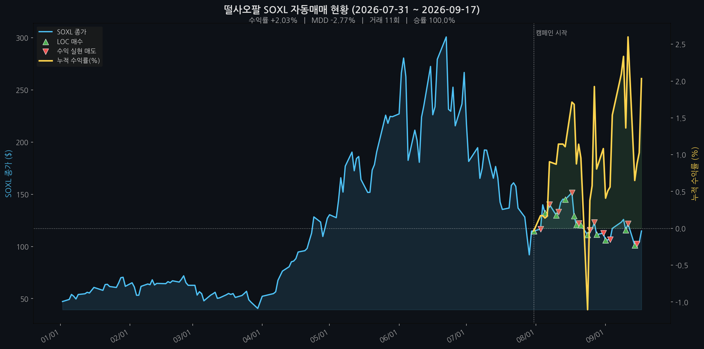

# 떨사오팔 (SOXL 자동매매)

SOXL(반도체 3배 레버리지 ETF)에 "떨어지면 사고 오르면 판다" 평균회귀 전략을 적용한 개인 자동매매 봇.
한국투자증권(KIS) Open API + GitHub Actions로 매일 자동 실행됩니다.

매수 ▲ / 수익 실현 매도 ▽ / 손절 ✕ 시점과, 캠페인 시작일 기준 누적 수익률을 매일 자동 갱신합니다.



## 📈 매매법: 떨사오팔

이름 그대로 "떨어지면 사고, 오르면 판다" — 변동성이 큰 SOXL의 단기 평균회귀(mean reversion) 성향을 이용하는 분할매수 전략입니다.

- **매수 (LOC):** 종가가 전날 종가보다 낮거나 같으면, 전날 종가를 주문가로 LOC(Limit on Close) 매수를 넣습니다. 한 번에 모든 자금을 쓰지 않고 자금을 여러 회차로 나눠 매수일마다 한 회차씩만 소진합니다.
- **복리 재투자:** 매도로 회수된 자금은 남은 회차 수만큼 다시 나눠 재투자되어, 자금이 점점 불어나는 구조입니다.
- **매도 (수익 실현, LOC):** 각 매수 회차는 개별로 관리되며, 매수가 대비 일정 비율(왕복 수수료를 커버하는 수준) 이상 오르면 해당 회차만 매도합니다.
- **손절 (MOC):** 일정 기간 이상 보유한 회차는 더 오르길 기다리지 않고 시장가(MOC)로 정리합니다.

이 전략은 SOXL이 등락을 반복하는 횡보·하락 구간에서 강하지만, **지속적인 상승장에서는 매수 신호 자체가 잘 나오지 않아 시장 수익률을 따라가지 못하는 한계**가 있습니다. 반대로 가장 위험한 시나리오는 진입 시점이 아니라 **장기간 회복 없는 하락장**입니다.

## 🏗 구조

```
GitHub Actions (매일 스케줄)
 ├─ morning-task → 주문 계산(start_date~어제 전체 재시뮬레이션) → KIS API로 LOC/MOC 주문 제출
 └─ evening-task → KIS API로 전일 종가 조회 → DB 업데이트 → README 차트 재생성
        └─ 결과(가격 DB, 보유 회차, 로그, 차트)를 그대로 이 레포에 커밋
```

- **전략 실행:** `daily_run.py`가 거래일 판정·주문 계산·제출을 오케스트레이션하고, 실제 매수/매도 판단은 `backtest_today.py`의 시뮬레이션 로직이 매번 시작일부터 다시 계산합니다.
- **데이터 저장:** GitHub Actions 러너는 매번 새로 뜨는 휘발성 환경이라, `data/trading.db`(가격 이력)와 보유 회차 정보를 **이 레포 자체를 DB처럼 사용**해 매일 자동 커밋합니다.
- **브로커 연동:** `kis_api.py`가 한국투자증권 Open API(OAuth 토큰, 해외주식 시세/주문/잔고)를 래핑합니다.
- **모드 분리:** `dry-run`/`live` 모드별로 로그·보유 회차 파일이 분리 저장되어, 실거래 전에 안전하게 동작을 확인할 수 있습니다.
- **차트:** `generate_chart.py`가 SOXL 연중 가격과 캠페인 시작일 기준 누적 수익률을 분석용 시뮬레이션(`backtest_all.py`)으로 계산해 매일 이 README의 그래프를 갱신합니다.
